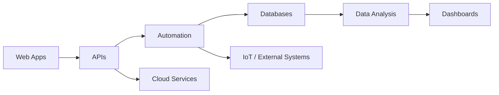

<div align="center">

# Enrique Zúñiga

### Full Stack Developer · Automation · Data · IoT

Desarrollo soluciones web, automatizaciones e integraciones orientadas a resolver problemas reales mediante software, datos y tecnología.

[](https://zenriquezs.github.io/EnriqueZS/)
[](https://www.linkedin.com/in/enrique-zs/)
[](https://github.com/zenriquezs)

</div>

---

## Sobre mí

Soy desarrollador orientado a la creación de **aplicaciones web, sistemas administrativos, automatización de procesos, integración de APIs y soluciones basadas en datos**.

Mi experiencia combina desarrollo frontend y backend con bases de datos, infraestructura, IoT y análisis de información. He trabajado en proyectos que involucran desde interfaces web y sistemas de autenticación hasta plataformas de gestión, procesamiento de datos e integración de hardware y software.

Me interesa especialmente construir soluciones que sean:

* Escalables y fáciles de mantener
* Seguras desde su diseño
* Orientadas a automatizar procesos
* Basadas en datos para apoyar la toma de decisiones
* Simples y funcionales para el usuario final

Actualmente enfoco mi crecimiento profesional en **backend, arquitectura de software, automatización, datos, cloud y ciberseguridad**.

---

## Tech Stack

### Backend & Automation

<p align="left">
  
</p>

`REST APIs` · `Automation` · `Data Processing` · `Backend Architecture`

### Frontend

<p align="left">
  
</p>

### Databases & Data

<p align="left">
  
</p>

`SQL Server` · `Power BI` · `Data Analysis` · `ETL`

### Cloud, Infrastructure & Tools

<p align="left">
  
</p>

### IoT & Networking

`IoT` · `LoRa` · `GPS` · `MQTT` · `Sensors` · `LAN` · `VLAN`

---

## Áreas de especialización

```text
Web Development       ███████████████████░
Backend & APIs        ██████████████████░░
Databases             ██████████████████░░
Automation            █████████████████░░░
Data & BI             ████████████████░░░░
IoT                   ███████████████░░░░░
Cloud & Security      ██████████████░░░░░░
```

---

## Experiencia

### Desarrollo Full Stack

Desarrollo de aplicaciones y plataformas web combinando frontend, backend y bases de datos.

He trabajado con funcionalidades como:

* Autenticación y autorización de usuarios
* Sistemas administrativos
* Gestión de usuarios y roles
* Formularios y validación de información
* Integración con bases de datos
* APIs REST
* Interfaces responsive
* Procesamiento y visualización de datos

---

### Desarrollo Web Freelance

Desarrollo de soluciones web para distintos requerimientos, desde landing pages hasta aplicaciones dinámicas.

Experiencia trabajando con:

`JavaScript` · `React` · `PHP` · `HTML` · `CSS` · `Firebase` · `MySQL`

---

### Datos & Automatización

Diseño de procesos para transformar información en estructuras que puedan ser analizadas, consultadas y visualizadas.

Áreas de trabajo:

* Procesamiento de datos con Python
* Estandarización de información
* Diseño de bases de datos
* Automatización de procesos
* Integración de sistemas
* Dashboards y análisis con Power BI

---

## Proyectos destacados

### GeoTransport Shield

**IoT · LoRa · GPS · Seguridad**

Prototipo tecnológico para el seguimiento de transporte de carga mediante comunicación LoRa y posicionamiento GPS.

El sistema integra hardware y software para proporcionar información de ubicación y contribuir a mejorar la seguridad y monitoreo del transporte.

---

### Plataforma de Gestión Ambiental

**Data · Web · Databases · Reporting**

Sistema enfocado en la gestión y análisis de información relacionada con emisiones de gases contaminantes.

Permite estructurar información ambiental y generar datos útiles para análisis y toma de decisiones.

---

### IoT & STEM Challenges

**Python · Sensors · Electronics · Automation**

Desarrollo de soluciones utilizando programación, electrónica, sensores e Internet de las Cosas para resolver diferentes retos tecnológicos.

Participación en competencias STEM dentro de la categoría de **Internet de las Cosas (IoT)**.

---

## Lo que estoy construyendo

Mi enfoque actual está en conectar diferentes áreas tecnológicas dentro de una misma solución:



La idea es desarrollar sistemas donde **aplicaciones, datos, automatización e infraestructura trabajen como un solo ecosistema**.

---

## Certificaciones

### Microsoft

* Protect your Applications
* Implement Platform Protection
* Secure Access with Azure Active Directory
* Identity Protection and Governance

### Cisco Networking Academy

* CCNA: Switching, Routing & Wireless Essentials

### Google

* Fundamentals: Data, Data, Everywhere

### Dataquest

* Python for Data Science

### Desarrollo & Tecnología

* Desarrollo de Aplicaciones Web con Laravel
* Gestión de Bases de Datos con MySQL y Firebase
* IoT y Sensores Inteligentes
* Fundamentos de Ciberseguridad

---

## GitHub Analytics

<div align="center">


</div>

<div align="center">


</div>

---

## Current Focus

```javascript
const enrique = {
    role: "Full Stack Developer",

    focus: [
        "Backend Development",
        "Process Automation",
        "Data Engineering",
        "APIs & Integrations",
        "Cloud & Infrastructure",
        "Cybersecurity"
    ],

    technologies: {
        backend: ["PHP", "Laravel", "Python"],
        frontend: ["JavaScript", "React", "Tailwind CSS"],
        databases: ["MySQL", "SQL Server", "Firebase"],
        data: ["Python", "Power BI"],
        infrastructure: ["Linux", "Docker", "Azure"],
        iot: ["LoRa", "MQTT", "GPS"]
    },

    philosophy: "Build systems that solve real problems."
};
```

---

## Conecta conmigo

Si te interesa colaborar en proyectos relacionados con **desarrollo web, automatización, datos o tecnología**, puedes encontrarme aquí:

<p align="left">

<a href="https://www.linkedin.com/in/enrique-zs/">
  
</a>

<a href="https://github.com/zenriquezs">
  
</a>

<a href="https://zenriquezs.github.io/EnriqueZS/">
  
</a>

</p>

---

<div align="center">

### Building systems. Automating processes. Turning data into solutions.

</div>
